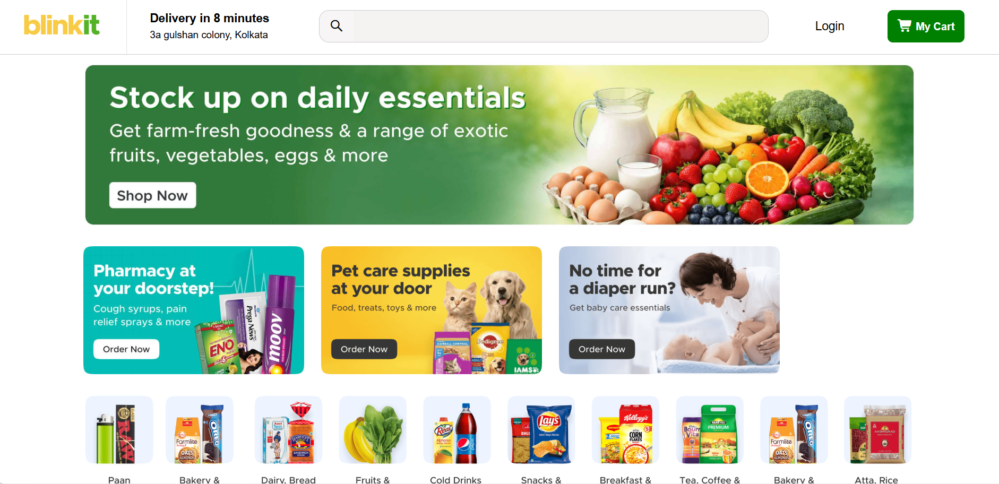
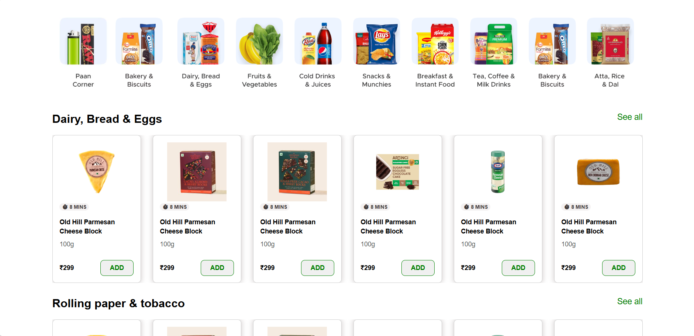
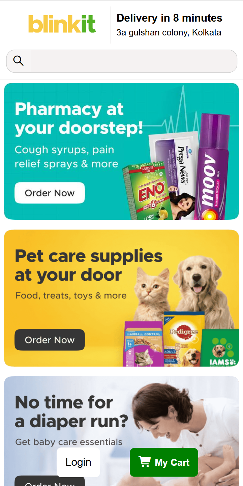

# Blinkit Clone

A Blinkit-inspired frontend project built using HTML and CSS, focused on responsive design, clean layout, and user-friendly interface structure.

## Overview
This project was created to practice frontend development by recreating a Blinkit-inspired user interface. It focuses on responsive layout design, structured sections, and improving the browsing experience across different screen sizes.

## Tech Stack
- HTML
- CSS

## Features
- Responsive design for desktop, tablet, and mobile
- Clean homepage layout
- Structured product sections
- User-friendly interface
- Frontend UI practice project

## Screenshots

### Homepage

### Product Sections

### Mobile View

## Purpose
The purpose of this project is to strengthen my frontend development skills by building a responsive real-world inspired interface and improving my understanding of layout, styling, and responsive design.

## Future Improvements
- Add more sections and polish the layout
- Improve visual consistency
- Add interactivity in future versions

## Author
Rinku (Ransh) Prajapat
